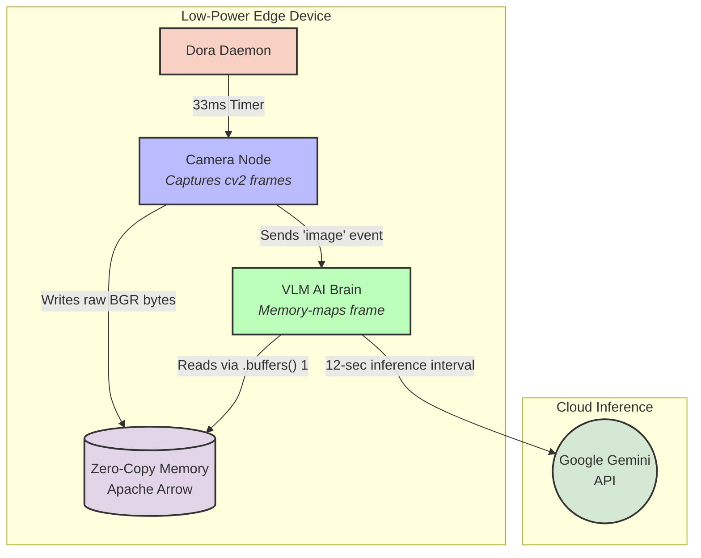

# Lightweight VLM Robotic Brain (Gemini API)

This example demonstrates how to use Dora to pipe high-speed video frames directly into a multimodal Vision-Language Model (Google Gemini 1.5 Flash) via a Cloud API to give a robot real-time spatial awareness.

### ⚡ Why an API-Based VLM?
While local VLMs (like Qwen) are powerful, they require high-end hardware and massive amounts of GPU VRAM (often 16GB+). 
**This example is designed for low-power edge devices.** By utilizing Dora's zero-copy memory to grab frames and passing the inference workload to a Cloud API, this pipeline can run advanced spatial reasoning on a $35 Raspberry Pi, an old laptop, or any hardware without a dedicated GPU.

## Pipeline Architecture



## Node Details
1. **Camera Node (`camera_node`)**: Connects to the local webcam via OpenCV, resizes the frame to 640x480, and flattens it into a 1D byte array. It sends this raw buffer into Dora's shared memory at 30 FPS.
2. **VLM AI Brain (`vlm_brain`)**: A Python node that intercepts the memory buffer. To respect API rate limits and avoid zero-copy memory deadlocks during network latency, it:
   * Reconstructs the image from the Arrow buffer once every 12 seconds.
   * Utilizes `np.frombuffer(...).copy()` to move the data into local Python RAM.
   * Explicitly drops the Arrow event (`del event`) to instantly release the zero-copy memory lock back to Dora.
   * Prompts Gemini 1.5 Flash to act as a robot's eyes and declare the path `CLEAR` or `BLOCKED`.

## Prerequisites
* Python 3.8+
* A free [Google AI Studio API Key](https://aistudio.google.com/)

```bash
pip install opencv-python pillow google-generativeai numpy pyarrow
export GEMINI_API_KEY="your_api_key_here"
```

## Run the Dataflow

```bash
dora run dataflow.yml
```