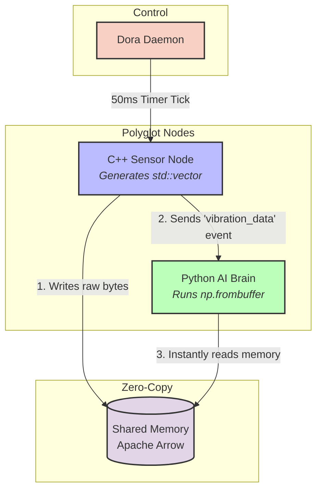

# Polyglot Edge AI: C++ and Python nodes for anomaly detection example

This example demonstrates Dora's polyglot capabilities by bridging a compiled hardware language (C++) and an interpreted AI language (Python) using zero-copy memory.

## Pipeline Architecture

Here is how the data flows under the hood without ever copying the memory:



## Node Details
1. **C++ Sensor (`cxx_sensor`)**: Simulates a high-frequency vibration sensor. It generates a `std::vector<float>`, occasionally injects an anomalous mechanical spike, and casts the raw bytes to a zero-copy `rust::Slice`.
2. **Python AI Brain (`py_brain`)**: Bypasses standard object creation by extracting the raw memory buffer from the Apache Arrow event (`.buffers()[1]`). It instantly maps this memory to a `numpy` array for ultra-low latency AI inference.

## Prerequisites
* A C++ compiler and `cmake`
* Python dependencies: `pip install numpy pyarrow`

## Build and Run

1. **Compile the C++ Node:**
```bash
mkdir build
cd build
cmake ..
make
cd ..
```

2. **Run the Dataflow:**
```bash
dora run dataflow.yml
```


