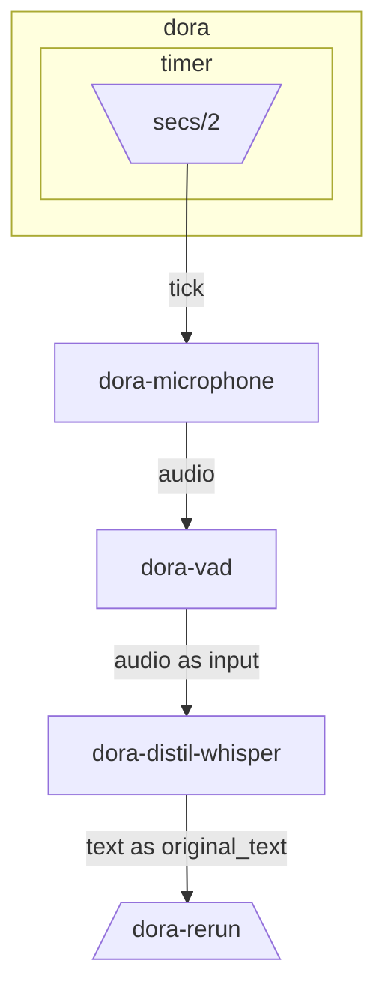

# Dora Speech to Text Example

This example demonstrates real-time speech-to-text transcription using Dora's dataflow architecture with Whisper model integration.

## Overview

This example showcases a complete speech-to-text pipeline using Dora's node-based architecture. It captures audio from a microphone, performs voice activity detection (VAD), transcribes speech using Whisper, and displays results in Rerun.

## Architecture

The system consists of the following components:

### Core Components

1. **dora-microphone** (`dora-microphone`)
   - Captures audio from the system microphone
   - Triggered every 2 seconds by a timer
   - Outputs audio data for processing

2. **dora-vad** (`dora-vad`)
   - Voice Activity Detection using Silero VAD
   - Filters audio to only process segments containing speech
   - Reduces unnecessary processing of silence

3. **dora-whisper** (`dora-distil-whisper`)
   - Transcribes speech to text using Whisper model
   - Configurable target language (default: English)
   - Uses MLX-optimized Whisper for Apple Silicon

4. **dora-rerun** (`dora-rerun`)
   - Visualizes transcription results
   - Provides real-time monitoring of the pipeline

### Data Flow

1. Timer triggers microphone to capture audio (every 2 seconds)
2. Audio is sent to VAD for speech detection
3. Detected speech segments are forwarded to Whisper
4. Whisper transcribes the audio to text
5. Text is displayed in Rerun viewer

## Prerequisites

Make sure you have the following installed:
- **dora**: Dora framework (`pip install dora-rs-cli` or build from source)
- **uv**: Python package manager
- **Python 3.11+**: For Python nodes

## Setup and Running

### 1. Environment Setup

```bash
cd examples/speech-to-text

# Create Python virtual environment
uv venv --seed -p 3.11
```

### 2. Build the System

```bash
# Build all components (this will download dependencies)
dora build whisper.yml --uv
```

### 3. Run the System

```bash
# Start the dataflow
dora run whisper.yml --uv

# Note: Wait for the Whisper model to download on first run (may take some time)
```

### 4. View Results

Connect to Rerun viewer to see transcription results:
```bash
rerun --connect rerun+http://127.0.0.1:9876/proxy
```

## Configuration

### Environment Variables

- `TARGET_LANGUAGE`: Set the transcription target language (default: `english`)

### Available Dataflows

- `whisper.yml`: Production dataflow with pre-packaged nodes
- `whisper-dev.yml`: Development dataflow for local development

## Graph Visualization



## Troubleshooting

### Common Issues

1. **Microphone permissions**: Ensure your terminal/application has microphone access permissions
2. **Model download**: First run may take time to download the Whisper model
3. **Rerun version mismatch**: If you see version warnings, install matching Rerun SDK version
